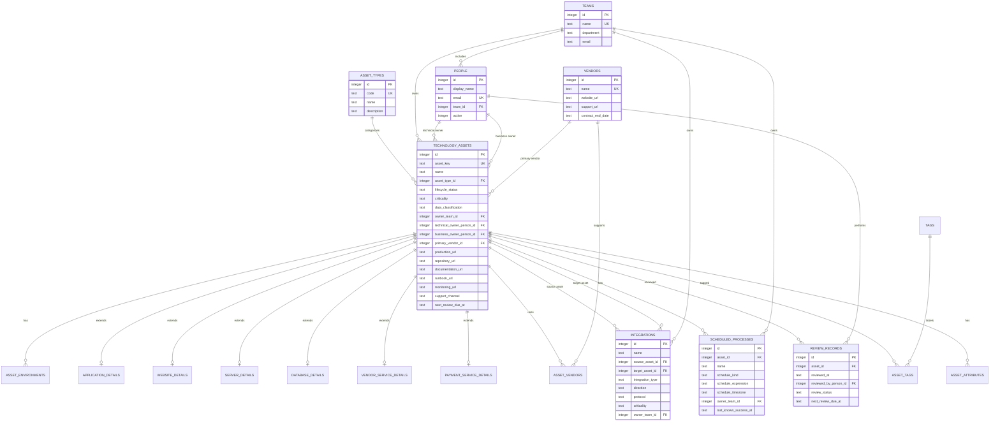

# Database Diagram

The diagram below shows the initial SQLite database model. The design centers on `technology_assets`, with reference tables for ownership and category, detail tables for type-specific facts, and relationship tables for tags, vendors, integrations, scheduled processes, and reviews.

